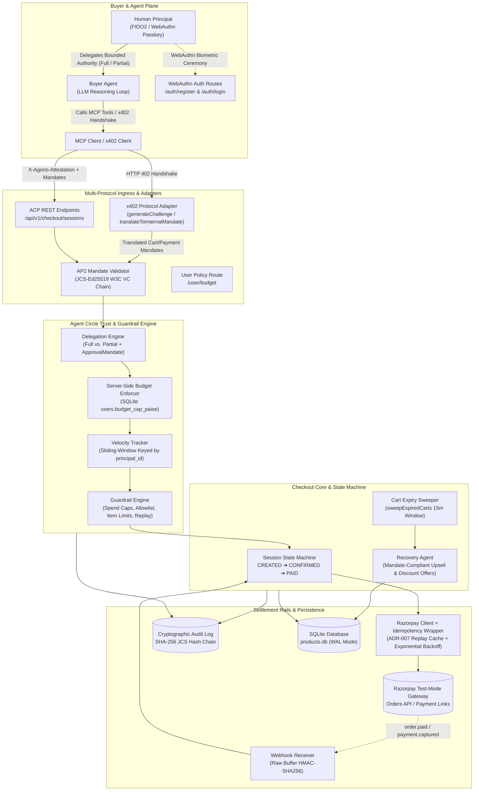

# Architecture — Agentic Commerce & Agent Circle Trust Engine

> **Authoritative Technical Blueprint — Version 2.0 (2026-08-31)**  
> Multi-Protocol Agentic Commerce (ACP + AP2 + x402) on Razorpay Rails, secured by the Agent Circle Trust Engine, FIDO2 WebAuthn Passkeys, Server-Side Sliding-Window Velocity Guardrails, and a Tamper-Evident Hash-Chained Audit Log.

---

## 1. System Architecture Overview

The platform enables autonomous AI buyer agents to discover, negotiate, and settle commercial transactions on behalf of human principals with bounded cryptographic authority and strict liability enforcement.



---

## 2. Invariable Core Principles

1. **Authoritative Minor Units (Paise)**: All monetary values are strictly represented as integers in minor currency units (paise; ₹1.00 = `100` paise). Floating-point currency arithmetic is strictly prohibited across all modules.
2. **Strict Liability Keying**: Spending caps, velocity tracking, and WebAuthn sessions are strictly keyed to the liable human `principal_id` (`usr_alice`), never to transient `agent_id`, `intent_id`, or `session_id`.
3. **Drop Agent-Supplied Budget Limits**: The server unilaterally drops any client/agent-supplied budget parameters (`budget_in_rupees`), enforcing the authoritative ceiling stored in SQLite (`users.budget_cap_paise`) and appending an `IGNORED_AGENT_SUPPLIED_LIMIT` audit block.
4. **Deterministic Mandate Hashing**: All AP2 and x402 mandates use canonical JSON serialization (RFC 8785 / JCS) with detached Ed25519 signatures (`eddsa-jcs-2022`).
5. **Tamper-Evident Audit Trail**: Every money movement, guardrail evaluation, webhook event, and security exception appends to an immutable, linear SHA-256 hash chain with (O(n)) `verifyChain()` proof verification.

---

## 3. Protocol Adapters & Ingress Layer

### 3.1 x402 Adapter (`src/adapters/x402Adapter.js`)
Enables zero-friction HTTP 402 Payment Required handshakes for Web3 and autonomous AI agent micro-settlements:
- **`generateChallenge(cartAmount, address, options)`**: Produces a standard x402 challenge payload specifying payment address, network (`base`), amount in paise, unique challenge ID, and cryptographic nonce.
- **`translateToInternalMandate(x402PaymentPayload, principalId, context)`**: Ingests inbound x402 transaction receipts/proofs and translates them directly into canonical `CartMandate` and `PaymentMandate` objects acceptable to the Trust Engine.

### 3.2 AP2 Mandate Chain (`schemas/validate.js`, `src/lib/jcs-eddsa.js`)
Implements the 3-tier W3C Verifiable Credential mandate chain:
1. **`IntentMandate`**: Signed by the human buyer (or delegated agent with WebAuthn credentials), defining natural language intent, maximum allowable spend, allowed categories, and time bounds.
2. **`CartMandate`**: Signed by the merchant server, locking concrete line items, unit prices, tax, and total price for an execution window.
3. **`PaymentMandate`**: Signed by the merchant processor-of-record, binding the cart to a concrete Razorpay order with execution authority (`agent` order orchestration or `human` approval link).

### 3.3 ACP 5-Stage REST Interface (`src/routes/checkout.js`)
Exposes the canonical Agentic Commerce Protocol endpoints:
- `POST /api/v1/checkout/sessions`: Initialize session from `IntentMandate` (`CREATED`).
- `PATCH /api/v1/checkout/sessions/:id`: Update cart items with re-minted `CartMandate`.
- `GET /api/v1/checkout/sessions/:id`: Query state, mandates, and Razorpay order references.
- `POST /api/v1/checkout/sessions/:id/complete`: Enforce idempotency, delegation, velocity, and settle order (`CONFIRMED`).
- `POST /api/v1/checkout/sessions/:id/cancel`: Void active session and release allocated resources (`CANCELLED`).

---

## 4. Agent Circle Trust Engine & Guardrails

### 4.1 WebAuthn & Human Identity (`src/circle/webauthn.js`, `src/routes/auth.js`)
- Protects administrative operations and human checkout authorization using FIDO2 / Passkey biometric ceremonies.
- Generates cryptographic challenges (`/auth/register/generate`, `/auth/login/generate`) and validates signed authentications (`/auth/register/verify`, `/auth/login/verify`).
- Issues HTTP-only session cookies establishing human presence and explicit liability for `principal_id`.

### 4.2 Delegation Engine (`src/lib/delegation.js`)
Controls autonomous agent spend authority:
- **`full` Delegation**: Autonomous execution is permitted if and only if the transaction amount is within the configured spend cap (`transactionPaise <= capPaise`).
- **`partial` Delegation**: Autonomous execution is strictly forbidden. The engine rejects completions with `HTTP 402 APPROVAL_MANDATE_REQUIRED` unless a cryptographically valid `ApprovalMandate` signed by the human principal is attached.

### 4.3 Sliding-Window Velocity Tracker (`src/lib/velocityTracker.js`, `src/middleware/guardrails.js`)
- **Keying**: Exclusively tracks spend against `principal_id` (the liable human account). Never keys by `intent_id` or `session_id`, preventing velocity bypass via intent spam.
- **Sliding Window Ledger**: In-memory sliding window (default 1 hour).
- **Decoupled Verification & Recording**:
  - `checkVelocity(principalId, amountPaise, capPaise, windowMs)`: Non-mutating pre-flight verification.
  - `recordSpend(principalId, amountPaise)`: Mutating post-capture commitment invoked only after money movement succeeds.

---

## 5. Session State Machine & Autonomous Recovery

### 5.1 State Machine Lifecycle (`src/lib/sessionStateMachine.js`)
```
          ┌─────────────┐
          │   CREATED   │ ──(PATCH update)──┐
          └─────────────┘                   │
           │           │                    │
   (cancel)│           │ (complete)         │
           ▼           ▼                    │
     ┌───────────┐ ┌───────────┐            │
     │ CANCELLED │ │ CONFIRMED │ ◄──────────┘
     └───────────┘ └───────────┘
                         │ (webhook: order.paid / payment.captured)
                         ▼
                   ┌───────────┐
                   │   PAID    │ ──▶ FULFILLING ──▶ COMPLETED
                   └───────────┘
                         │ (decline / error / timeout)
                         ▼
                   ┌───────────┐
                   │  FAILED   │
                   └───────────┘
```

- **State Transition Guard**: All state mutations pass through `transitionSession(session, nextState)`, which strictly validates legal transitions and updates `updatedAt`.
- **Concurrency Isolation**: Employs `session._isProcessing` lock to prevent race conditions during parallel completion attempts.

### 5.2 Cart Expiry Sweeper & Recovery Agent (`src/lib/recoveryAgent.js`)
- Periodic sweeper (`sweepExpiredCarts`, running every 60s) scans for `CREATED` / `CONFIRMED` sessions inactive for > 15 minutes.
- Transitions abandoned sessions to `EXPIRED`.
- Automatically executes `generateRecoveryOffer(cartId, lineItems, offerPolicy)` to compute a mandate-compliant discount/upsell.
- Persists recovery offers into SQLite table `recovery_offers` as pending agent-proposed carts.

---

## 6. Settlement Rails & Razorpay Integration

### 6.1 Idempotency Wrapper & Error Classification (`src/lib/razorpayClient.js`, `src/lib/razorpayIdempotencyWrapper.js`)
- **ADR-007 Idempotent Replays**: `POST /complete` caches completion responses scoped by `session.sessionId` and `Idempotency-Key`. Replayed requests return the original response verbatim without re-executing Razorpay orders.
- **Error Classifier (`RazorpayRequestError`)**:
  - **Retryable Errors (Network timeouts, 5xx Gateway errors)**: Handled via exponential backoff (3 attempts, 200ms–2000ms jitter) and return `502 Bad Gateway` if exhausted.
  - **Terminal Errors (Card declined, invalid credentials, 4xx)**: Mapped to `HTTP 400 PAYMENT_DECLINED` with `session.state = "FAILED"`.

### 6.2 Raw Buffer Webhook Receiver (`src/routes/webhooks.js`)
- Captures unparsed raw request buffer.
- Performs constant-time `crypto.timingSafeEqual` HMAC-SHA256 signature verification against `process.env.RAZORPAY_WEBHOOK_SECRET`.
- Deduplicates events via `processedEventIds` set.
- Drives session transition: `CONFIRMED ➔ PAID`.

---

## 7. Cryptographic Audit Log (`src/lib/auditLog.js`)

```json
{
  "seq": 14,
  "entry_id": "log_a8f9c102",
  "timestamp": "2026-08-31T20:45:00.000Z",
  "session_id": "acp_sess_01J8Z3K7",
  "actor": "guardrail",
  "event_type": "MONEY_ACTION",
  "payload": {
    "amount_paise": 299900,
    "principal_id": "usr_alice",
    "razorpay_order_id": "order_TWPoM3tbS4lyv4"
  },
  "prev_hash": "e3b0c44298fc1c149afbf4c8996fb92427ae41e4649b934ca495991b7852b855",
  "hash": "7d5a3f...6b1"
}
```

- **Hash Formula**: `hash = SHA256( JCS(entry without "hash") )`.
- **Genesis Block**: Sequence `0` with `prev_hash` consisting of 64 zero characters.
- **Verification**: `sharedAuditLog.verifyChain()` walks from genesis to tip, verifying all link hashes and sequence numbers in (O(n)) time.

---

## 8. Adversarial Regression Suite (`tests/adversarial-judge-repro.test.js`)

The architecture is continuously validated against the core adversarial attack vectors:
1. **Attack 1 (Budget Override Injection)**: Prompt injection attempts to smuggle arbitrary budget caps via LLM metadata. Verified immune via server-side SQLite cap enforcement and `IGNORED_AGENT_SUPPLIED_LIMIT` audit logging.
2. **Attack 2 (Velocity Bypass via Intent Spam)**: Rapid sequential creation of new intents with high ticket quantities. Verified immune via `principal_id` sliding-window aggregation triggering `HTTP 403 GUARDRAIL_VELOCITY_EXCEEDED`.
3. **Attack 3 (Authorization Boundary Bypass)**: Direct API completion attempts with valid Agent attestation tokens but missing human WebAuthn credentials. Verified rejected with `HTTP 401 Unauthorized`.
4. **Attack 4 (x402 Signature Forgery)**: Forged or empty cryptographic signatures on the Multi-Protocol Gateway (`POST /x402/submit`). Verified immune via rigorous `InvalidProtocolError` bounds checks triggering `HTTP 400` and logging `GUARDRAIL_BLOCKED`.
