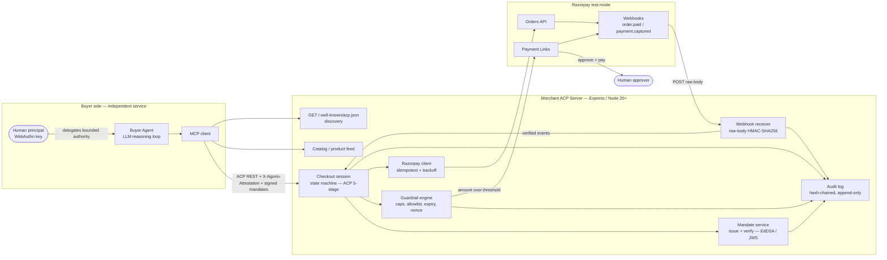

# Architecture — Agent Commerce Layer for Razorpay

**One line:** An ACP-shaped checkout server + an AP2-shaped signed-mandate chain, running on Razorpay test-mode rails, gated by a UAP-style guardrail layer and made tamper-evident by a hash-chained audit log, driven end-to-end by an LLM buyer agent.

Conventions used everywhere in this repo:
- **Money is an integer in minor units (paise).** ₹7,499.00 → `749900`. No floats, ever. (ADR-004)
- **Timestamps are RFC 3339 UTC** (`2026-08-21T10:15:30Z`).
- **ID prefixes:** `acp_sess_` (checkout session), `ord_` (our order), `man_intent_/man_cart_/man_pay_` (mandates), `log_` (audit entry). Razorpay owns `order_` and `pay_`.

---

## 1. Component diagram



**Trust boundaries:** (a) buyer agent → merchant server, crossed only with a valid `X-Agorio-Attestation` header **and** verifiable mandate signatures; (b) merchant server → Razorpay, crossed with API keys + idempotency keys; (c) Razorpay → merchant webhook, crossed only after raw-body HMAC-SHA256 verification. Every crossing writes an audit entry.

---

## 2. Data models (exact JSON)

### 2.1 Mandate envelope (shared by all three AP2 mandates)

All mandates share one envelope; only `claims` differ. This maps to a W3C Verifiable Credential (`type` ≈ VC type, `issuer`/`issued_at`/`expires_at` ≈ VC metadata, `proof` ≈ VC proof). Chained via `prev_mandate_id`.

```json
{
  "mandate_id": "man_intent_01J8Z3K9",
  "type": "IntentMandate",
  "spec": "ap2/0.1",
  "prev_mandate_id": null,
  "session_id": "acp_sess_01J8Z3K7",
  "issuer": "did:web:buyer.example#key-1",
  "subject": "usr_alice",
  "issued_at": "2026-08-21T10:15:30Z",
  "expires_at": "2026-08-21T10:45:30Z",
  "nonce": "b1c2d3e4f5a6b7c8",
  "claims": { "...type-specific, see below..." : true },
  "proof": {
    "type": "eddsa-jcs-2022",
    "alg": "EdDSA",
    "verification_method": "did:web:buyer.example#key-1",
    "jws": "eyJhbGciOiJFZERTQSJ9..detached-signature"
  }
}
```

The signature covers the **canonical JSON (JCS) of the whole object minus `proof.jws`**, so `prev_mandate_id`, `nonce`, `expires_at`, and every claim are inside the signed bytes.

### 2.2 IntentMandate — signed by the **buyer** (the user's WebAuthn-backed key, via the agent)

Delegates *bounded* authority to the agent. This is the ceiling everything else must fit under.

```json
{
  "mandate_id": "man_intent_01J8Z3K9",
  "type": "IntentMandate",
  "spec": "ap2/0.1",
  "prev_mandate_id": null,
  "session_id": "acp_sess_01J8Z3K7",
  "issuer": "did:web:buyer.example#key-1",
  "subject": "usr_alice",
  "issued_at": "2026-08-21T10:15:30Z",
  "expires_at": "2026-08-21T10:45:30Z",
  "nonce": "b1c2d3e4f5a6b7c8",
  "claims": {
    "natural_language_intent": "Buy over-ear noise-cancelling headphones under Rs 8000",
    "constraints": {
      "max_amount": 800000,
      "currency": "INR",
      "categories_allowed": ["audio", "electronics"],
      "merchant_allowlist": ["merch_razorpay_demo"],
      "max_quantity": 1
    },
    "principal": {
      "principal_id": "usr_alice",
      "auth_method": "webauthn",
      "credential_id": "V0ViQXV0aG5DcmVkZW50aWFsSWQ"
    },
    "agent": {
      "agent_id": "agent_buyer_01",
      "attestation_ref": "att_01J8Z3K6"
    }
  },
  "proof": { "type": "eddsa-jcs-2022", "alg": "EdDSA", "verification_method": "did:web:buyer.example#key-1", "jws": "..." }
}
```

### 2.3 CartMandate — signed by the **merchant**

Locks concrete line items and a price for a window. `amount_total` must satisfy the intent's `max_amount`; the merchant asserts `satisfies_intent`.

```json
{
  "mandate_id": "man_cart_01J8Z3KB",
  "type": "CartMandate",
  "spec": "ap2/0.1",
  "prev_mandate_id": "man_intent_01J8Z3K9",
  "session_id": "acp_sess_01J8Z3K7",
  "issuer": "did:web:merch.razorpay.demo#key-1",
  "subject": "acp_sess_01J8Z3K7",
  "issued_at": "2026-08-21T10:16:02Z",
  "expires_at": "2026-08-21T10:26:02Z",
  "nonce": "9f8e7d6c5b4a3928",
  "claims": {
    "merchant_id": "merch_razorpay_demo",
    "intent_mandate_id": "man_intent_01J8Z3K9",
    "line_items": [
      { "sku": "SKU-AUDIO-001", "title": "Acme NC-700 Headphones", "category": "audio", "quantity": 1, "unit_price": 749900 }
    ],
    "amount_subtotal": 749900,
    "amount_tax": 0,
    "amount_total": 749900,
    "currency": "INR",
    "price_locked_until": "2026-08-21T10:26:02Z",
    "satisfies_intent": true
  },
  "proof": { "type": "eddsa-jcs-2022", "alg": "EdDSA", "verification_method": "did:web:merch.razorpay.demo#key-1", "jws": "..." }
}
```

### 2.4 PaymentMandate — signed by the **merchant server acting as processor-of-record**

Binds the locked cart to exactly one Razorpay order and authorizes the charge. `approved_by` is `agent` (under threshold) or `human` (Payment Link approval). (ADR-002 explains why the merchant server, not Razorpay, signs this.)

```json
{
  "mandate_id": "man_pay_01J8Z3KD",
  "type": "PaymentMandate",
  "spec": "ap2/0.1",
  "prev_mandate_id": "man_cart_01J8Z3KB",
  "session_id": "acp_sess_01J8Z3K7",
  "issuer": "did:web:merch.razorpay.demo#key-1",
  "subject": "acp_sess_01J8Z3K7",
  "issued_at": "2026-08-21T10:16:05Z",
  "expires_at": "2026-08-21T10:21:05Z",
  "nonce": "1122334455667788",
  "claims": {
    "cart_mandate_id": "man_cart_01J8Z3KB",
    "amount": 749900,
    "currency": "INR",
    "psp": "razorpay",
    "razorpay_order_id": "order_PZxYwVuTsRqPoN",
    "capture": "automatic",
    "authorization": {
      "approved_by": "agent",
      "approval_ref": null,
      "guardrail_decision_id": "log_01J8Z3KC"
    }
  },
  "proof": { "type": "eddsa-jcs-2022", "alg": "EdDSA", "verification_method": "did:web:merch.razorpay.demo#key-1", "jws": "..." }
}
```

### 2.5 Order object (our internal record; 1:1 with a Razorpay order and a mandate chain)

```json
{
  "order_id": "ord_01J8Z3KE",
  "session_id": "acp_sess_01J8Z3K7",
  "state": "PAID",
  "amount": 749900,
  "currency": "INR",
  "line_items": [
    { "sku": "SKU-AUDIO-001", "title": "Acme NC-700 Headphones", "category": "audio", "quantity": 1, "unit_price": 749900 }
  ],
  "mandate_chain": {
    "intent_mandate_id": "man_intent_01J8Z3K9",
    "cart_mandate_id": "man_cart_01J8Z3KB",
    "payment_mandate_id": "man_pay_01J8Z3KD"
  },
  "razorpay": {
    "order_id": "order_PZxYwVuTsRqPoN",
    "payment_id": "pay_PZxZ12AbCdEfGh",
    "payment_link_id": null
  },
  "idempotency_key": "idem_complete_01J8Z3KD",
  "created_at": "2026-08-21T10:16:05Z",
  "updated_at": "2026-08-21T10:16:41Z",
  "failure": null
}
```

**State machine (ACP 5-stage):**
```
CREATED ──update──▶ CREATED
CREATED ──complete──▶ CONFIRMED ──webhook(order.paid|payment.captured)──▶ PAID ──▶ FULFILLING ──▶ COMPLETED
   │                     │
   └──cancel──▶ CANCELLED └──decline / timeout / price-drift──▶ FAILED
```
`failure` (when `state` ∈ {FAILED, CANCELLED}) is `{ "code": "PAYMENT_DECLINED", "reason": "...", "stage": "complete" }`.

### 2.6 Audit log entry (hash-chained, append-only)

`hash = SHA256( JCS(entry without the "hash" field) )`. Because `prev_hash` is *inside* the hashed bytes, entries are chained; any edit to entry *n* invalidates every entry ≥ *n*. Genesis entry uses `prev_hash` = 64 zeros.

```json
{
  "seq": 7,
  "entry_id": "log_01J8Z3KC",
  "timestamp": "2026-08-21T10:16:04Z",
  "session_id": "acp_sess_01J8Z3K7",
  "actor": "guardrail",
  "event_type": "GUARDRAIL_DECISION",
  "payload": {
    "check": "spend_cap",
    "outcome": "PASS",
    "detail": { "amount": 749900, "max_amount": 800000, "auto_approve_threshold": 1000000 },
    "refs": { "intent_mandate_id": "man_intent_01J8Z3K9", "cart_mandate_id": "man_cart_01J8Z3KB" }
  },
  "prev_hash": "3a7bd3e2360a3d29eea436fcfb7e44c735d117c42d1c1835420b6b9942dd4f1b",
  "hash": "b94d27b9934d3e08a52e52d7da7dabfac484efe37a5380ee9088f7ace2efcde9"
}
```

`event_type` ∈ `AGENT_REASONING | TOOL_CALL | MANDATE_ISSUED | MANDATE_VERIFIED | GUARDRAIL_DECISION | MONEY_ACTION | WEBHOOK_RECEIVED | STATE_TRANSITION | FAILURE`. `actor` ∈ `buyer_agent | merchant_server | razorpay | human | guardrail`. Large objects (full mandates, webhook bodies) are stored by hash in `payload.refs`, not inlined — the log stays compact and still tamper-evident.

---

## 3. API contracts (merchant server ⇄ buyer agent)

### 3.1 Authentication (every agent → merchant request)
| Header | Purpose |
|---|---|
| `X-Agorio-Attestation` | Agent identity — HMAC-signed token binding `agent_id` to the WebAuthn `principal_id`. Verified before any mandate is accepted. |
| `Idempotency-Key` | **Required** on `POST /complete`. Replaying the same key returns the first response, never a second charge. |
| `Content-Type: application/json` | All bodies. (Webhook route reads the raw buffer — see §3.4.) |

Signed mandates in the body are verified independently of the transport header: signature valid → not expired → `nonce` unused → chain links resolve.

### 3.2 Discovery & catalog
| Method | Path | Purpose |
|---|---|---|
| `GET` | `/.well-known/acp.json` | ACP discovery manifest (version, capabilities, lifecycle, endpoints). *Built.* |
| `GET` | `/api/v1/products` | ACP product feed: `sku, title, description, price (paise), currency, availability, category, images[], eligibility`. |
| `GET` | `/api/v1/products/{sku}` | Single product. |

### 3.3 Checkout session lifecycle — the 5 ACP endpoints
| # | Method | Path | Transition | Notes |
|---|---|---|---|---|
| 1 | `POST` | `/api/v1/checkout/sessions` | → `CREATED` | Body carries the **IntentMandate**. Server verifies it, runs guardrails vs. intent, builds a cart, returns a merchant-signed **CartMandate**. |
| 2 | `PATCH` | `/api/v1/checkout/sessions/{id}` | `CREATED` → `CREATED` | Change items/qty. Re-issues the CartMandate (new price-lock window). |
| 3 | `GET` | `/api/v1/checkout/sessions/{id}` | (read) | Current state + both mandates + order refs. |
| 4 | `POST` | `/api/v1/checkout/sessions/{id}/complete` | `CREATED` → `CONFIRMED` | **Idempotency-Key required.** Body carries the **PaymentMandate**. Server verifies the full chain + guardrails, creates a Razorpay Order, then either auto-captures (≤ threshold) or returns a Payment Link (> threshold). `PAID` is reached asynchronously via webhook. |
| 5 | `POST` | `/api/v1/checkout/sessions/{id}/cancel` | any non-terminal → `CANCELLED` | Voids the Razorpay order/link. |

**Example — create session (request):**
```json
POST /api/v1/checkout/sessions
X-Agorio-Attestation: att_01J8Z3K6.<hmac>
{
  "intent_mandate": { "...IntentMandate from 2.2..." : true },
  "requested_items": [{ "sku": "SKU-AUDIO-001", "quantity": 1 }]
}
```
**Response `201`:**
```json
{
  "session_id": "acp_sess_01J8Z3K7",
  "state": "CREATED",
  "cart_mandate": { "...CartMandate from 2.3..." : true },
  "amount_total": 749900,
  "currency": "INR",
  "expires_at": "2026-08-21T10:26:02Z"
}
```

**Example — complete (request):**
```json
POST /api/v1/checkout/sessions/acp_sess_01J8Z3K7/complete
X-Agorio-Attestation: att_01J8Z3K6.<hmac>
Idempotency-Key: idem_complete_01J8Z3KD
{ "payment_mandate": { "...PaymentMandate from 2.4 (without razorpay_order_id)..." : true } }
```
**Response `200` (auto-approved):**
```json
{
  "session_id": "acp_sess_01J8Z3K7",
  "state": "CONFIRMED",
  "order": { "order_id": "ord_01J8Z3KE", "razorpay_order_id": "order_PZxYwVuTsRqPoN" },
  "payment_mandate_id": "man_pay_01J8Z3KD",
  "next": "await_webhook"
}
```
**Response `202` (human approval required):**
```json
{ "session_id": "acp_sess_01J8Z3K7", "state": "CONFIRMED", "approval": { "type": "payment_link", "url": "https://rzp.io/i/xxxx", "payment_link_id": "plink_xxxx" }, "next": "await_human_then_webhook" }
```

**Error model (all endpoints):**
```json
{ "error": { "code": "GUARDRAIL_SPEND_CAP_EXCEEDED", "message": "amount 850000 exceeds intent max_amount 800000", "session_id": "acp_sess_01J8Z3K7", "retriable": false } }
```
Codes: `ATTESTATION_INVALID (401)`, `MANDATE_SIGNATURE_INVALID (400)`, `MANDATE_EXPIRED (400)`, `NONCE_REPLAYED (409)`, `GUARDRAIL_*_EXCEEDED (403)`, `PRICE_LOCK_EXPIRED (409)`, `PAYMENT_DECLINED (402)`, `IDEMPOTENCY_KEY_MISSING (400)`.

### 3.4 Webhooks (Razorpay → merchant)
| Method | Path | Notes |
|---|---|---|
| `POST` | `/api/v1/webhooks/razorpay` | **Raw body preserved**; HMAC-SHA256 verified with constant-time compare *before* JSON parse. *Built.* Handles `order.paid`, `payment.captured` → drives `CONFIRMED → PAID → FULFILLING → COMPLETED`. Idempotent on `event.id`. |

### 3.5 MCP tool surface (what the buyer agent actually calls)
The agent never sees REST directly; it calls these tools, which wrap §3.2–3.3.

```json
[
  { "name": "search_catalog", "description": "Find products by query/budget/category.",
    "input_schema": { "type":"object", "properties": { "query":{"type":"string"}, "max_amount":{"type":"integer","description":"paise"}, "category":{"type":"string"} }, "required":["query"] } },
  { "name": "create_cart", "description": "Open a checkout session from a signed IntentMandate; returns a CartMandate.",
    "input_schema": { "type":"object", "properties": { "intent_mandate":{"type":"object"}, "requested_items":{"type":"array"} }, "required":["intent_mandate","requested_items"] } },
  { "name": "get_cart_state", "description": "Read current session state + mandates.",
    "input_schema": { "type":"object", "properties": { "session_id":{"type":"string"} }, "required":["session_id"] } },
  { "name": "complete_checkout", "description": "Submit a signed PaymentMandate to charge. Idempotent.",
    "input_schema": { "type":"object", "properties": { "session_id":{"type":"string"}, "payment_mandate":{"type":"object"}, "idempotency_key":{"type":"string"} }, "required":["session_id","payment_mandate","idempotency_key"] } },
  { "name": "cancel_checkout", "description": "Abort a session and void any Razorpay order/link.",
    "input_schema": { "type":"object", "properties": { "session_id":{"type":"string"} }, "required":["session_id"] } }
]
```

---
See `docs/DECISIONS.md` for the ADRs behind every choice above.
